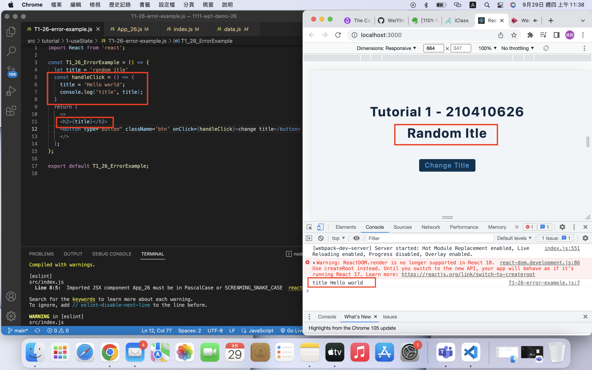
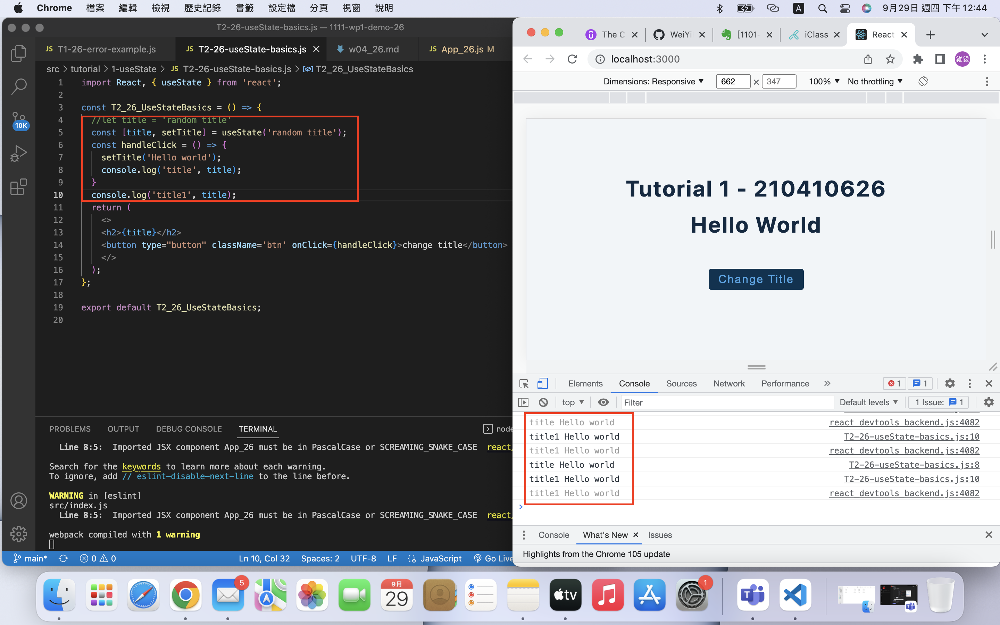
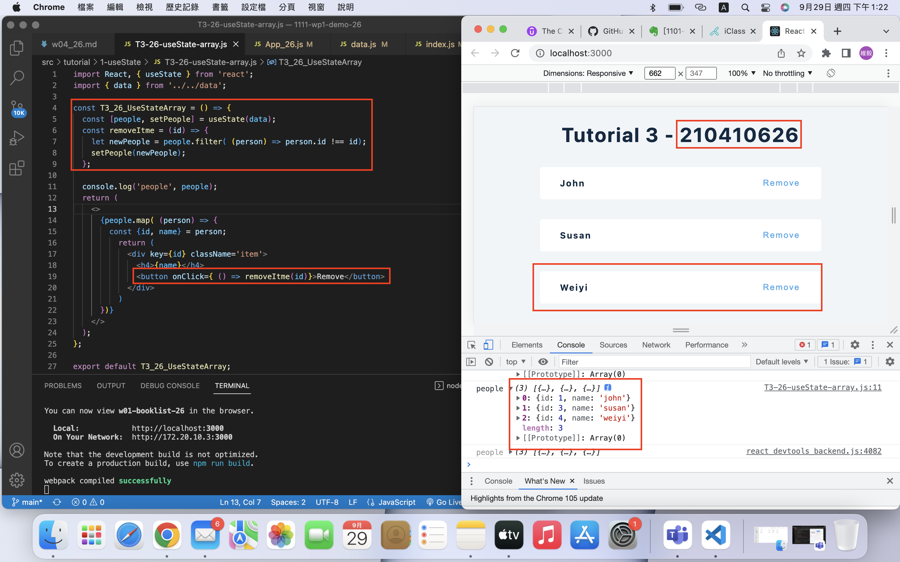
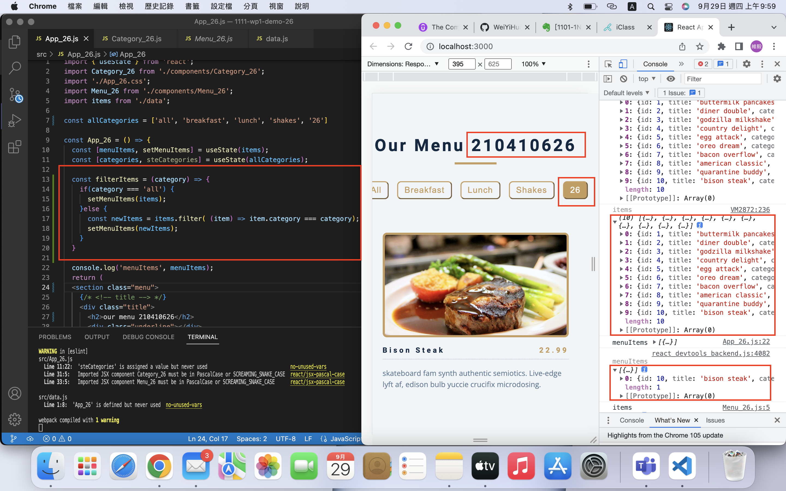

[GithubURL]()

### W04-P1: Hooks Tutorial T1_26

### W04-P2: Hooks Tutorial T12_xx, fix problem in T11_xx

### W04-P3: Hooks Tutorial T13_xx, useState using array of objects with remove item capability

### W04-P4: W03 menu demo, adding filter function for categories

### W04-logs: show all four logs done today

