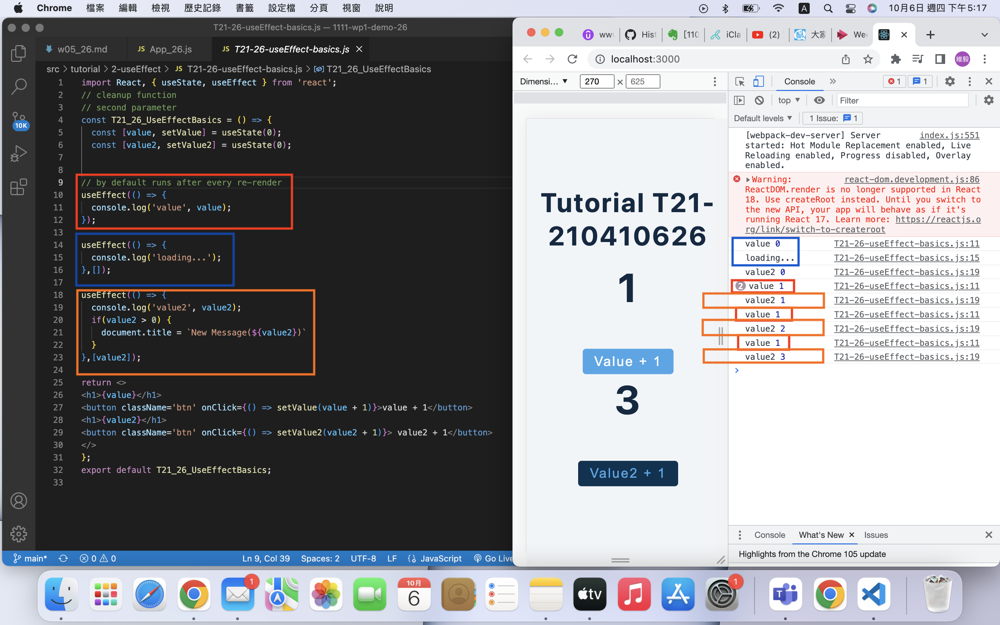
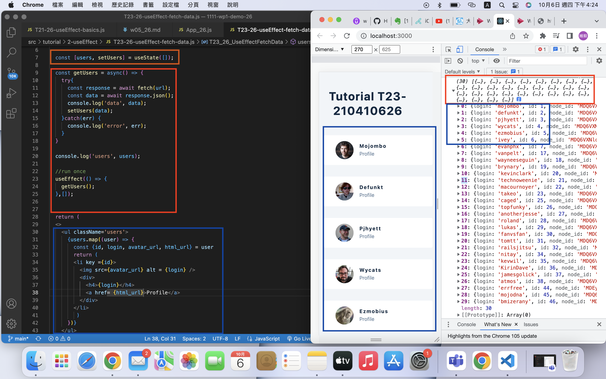
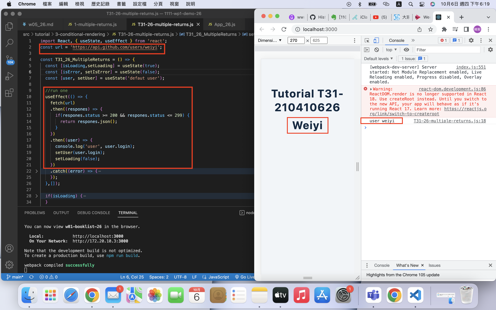
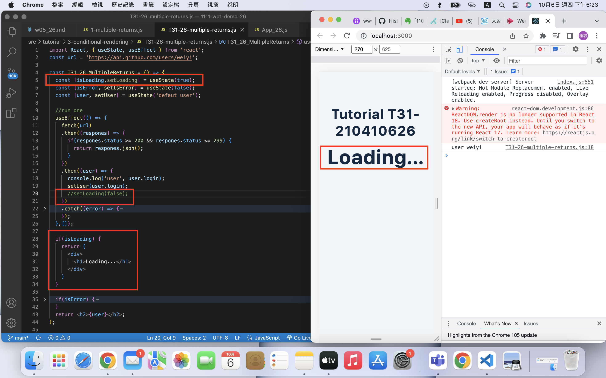
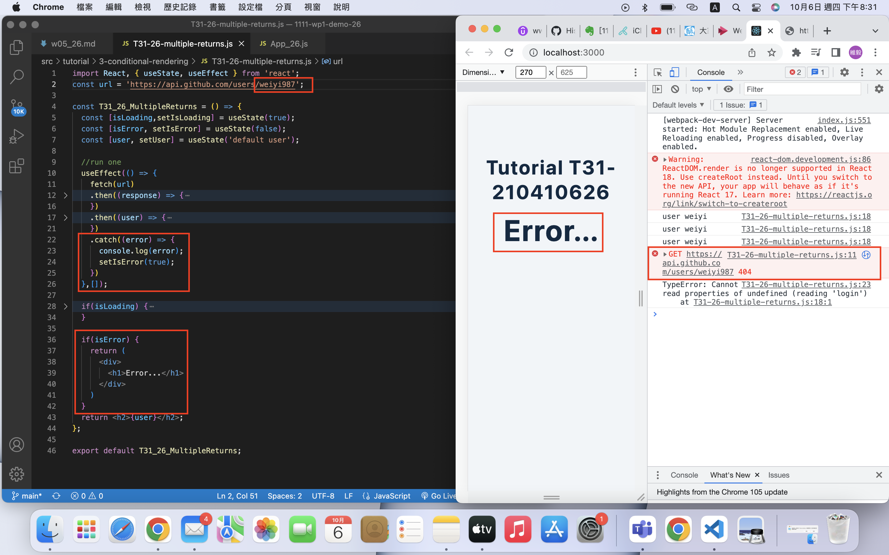

### W05-P1: Hooks Tutorial T14_xx

### W05-P2: useEffect 3 cases demo

### W05-P3: T23_xx: fetch data from Github and display them

### W05-P4: T31_xx: conditional rendering -- 3 cases

### W05-logs: show all four logs done today
