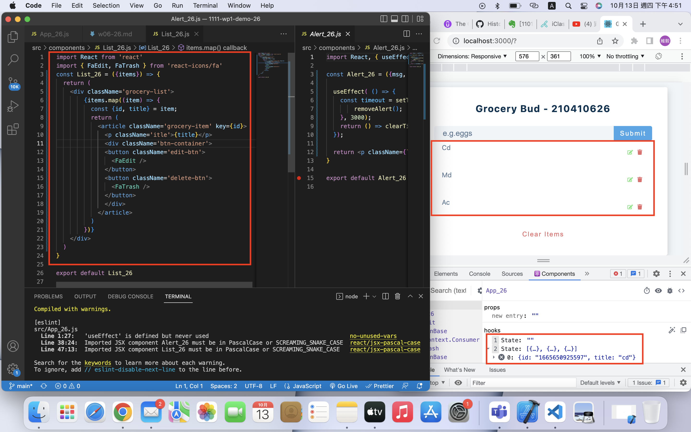
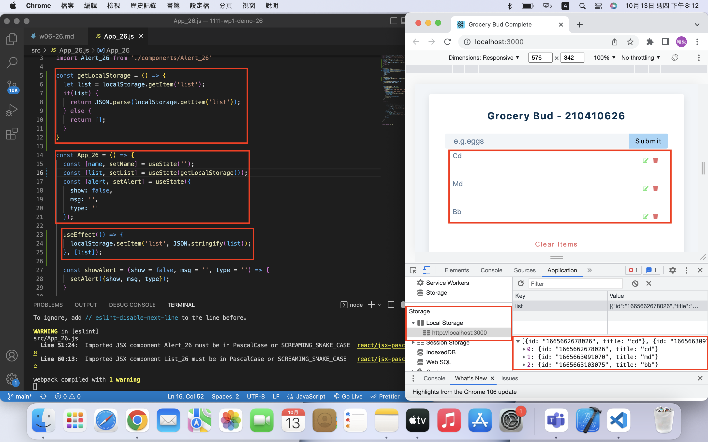
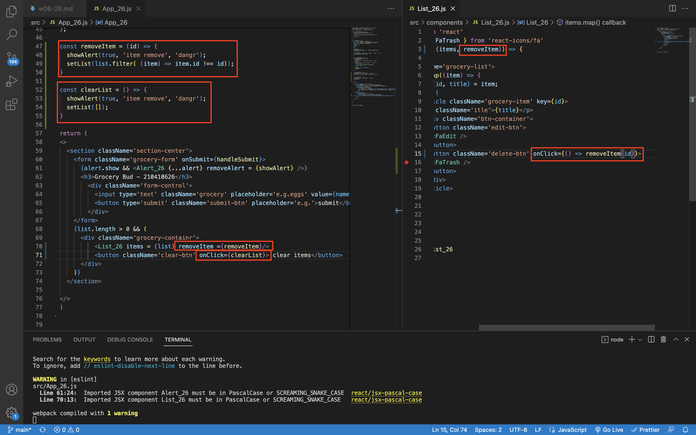
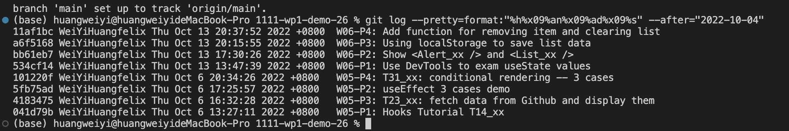

### W06-P1: Use DevTools to exam useState values


### W06-P2: Show <Alert_xx /> and <List_xx />


### W06-P3: Using localStorage to save list data


### W06-P4: Add function for removing item and clearing list


### W06-logs: show all four logs done today


```
(base) huangweiyi@huangweiyideMacBook-Pro 1111-wp1-demo-26 % git log --pretty=format:"%h%x09%an%x09%ad%x09%s" --after="2022-10-04"
11af1bc WeiYiHuangfelix Thu Oct 13 20:37:52 2022 +0800  W06-P4: Add function for removing item and clearing list
a6f5168 WeiYiHuangfelix Thu Oct 13 20:15:55 2022 +0800  W06-P3: Using localStorage to save list data
bb61eb7 WeiYiHuangfelix Thu Oct 13 17:30:26 2022 +0800  W06-P2: Show <Alert_xx /> and <List_xx />
534cf14 WeiYiHuangfelix Thu Oct 13 13:47:39 2022 +0800  W06-P1: Use DevTools to exam useState values

```