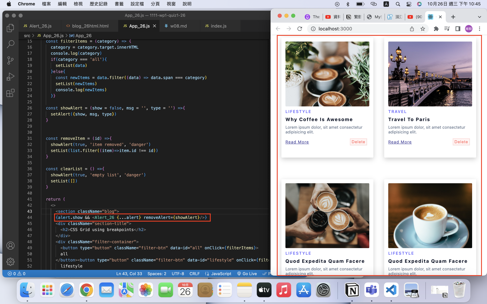
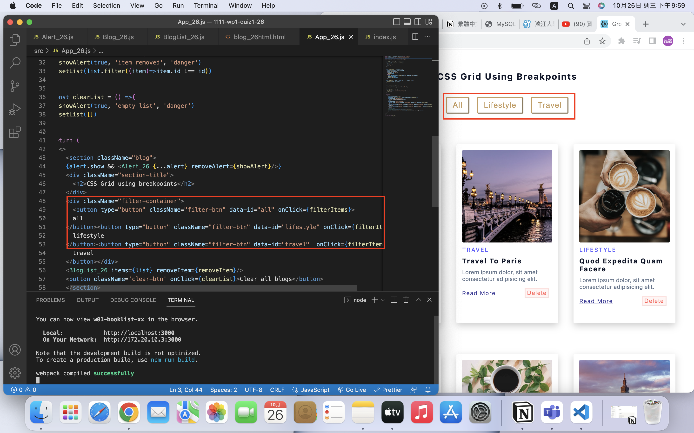
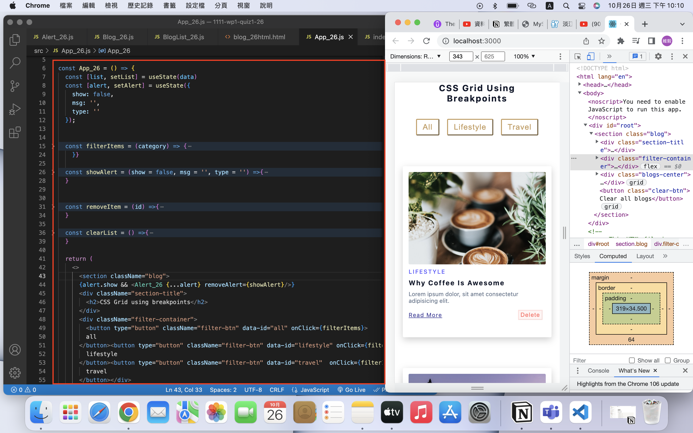
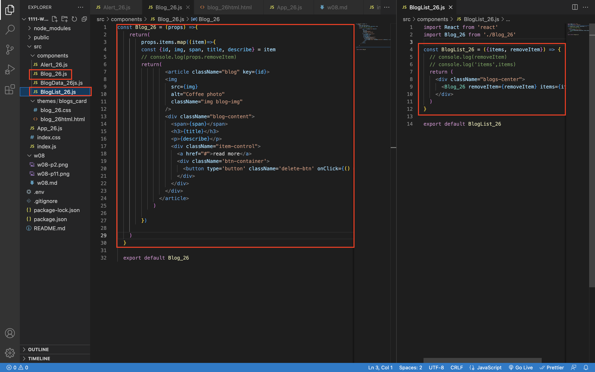
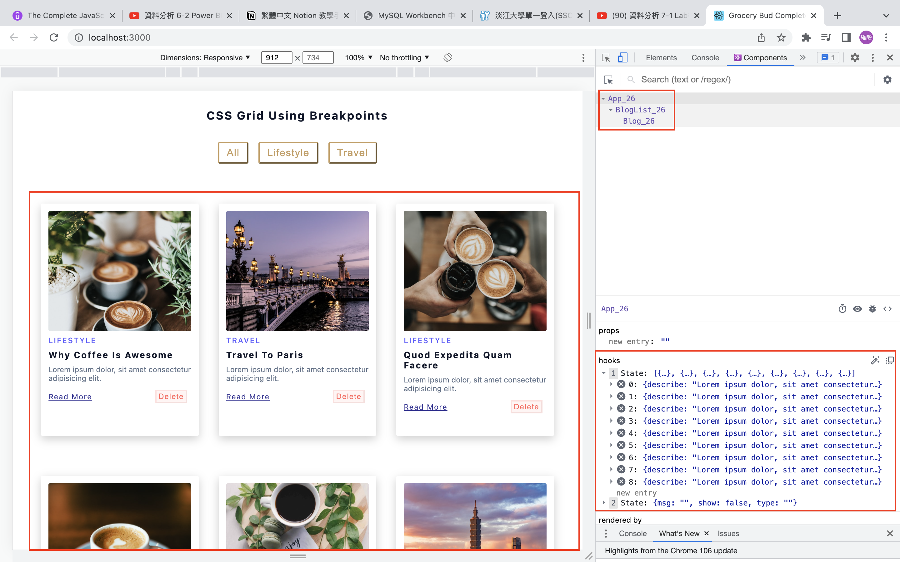
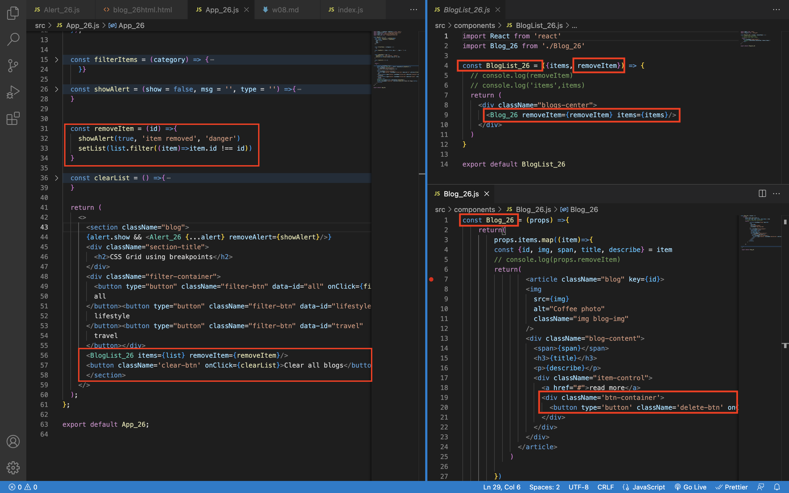
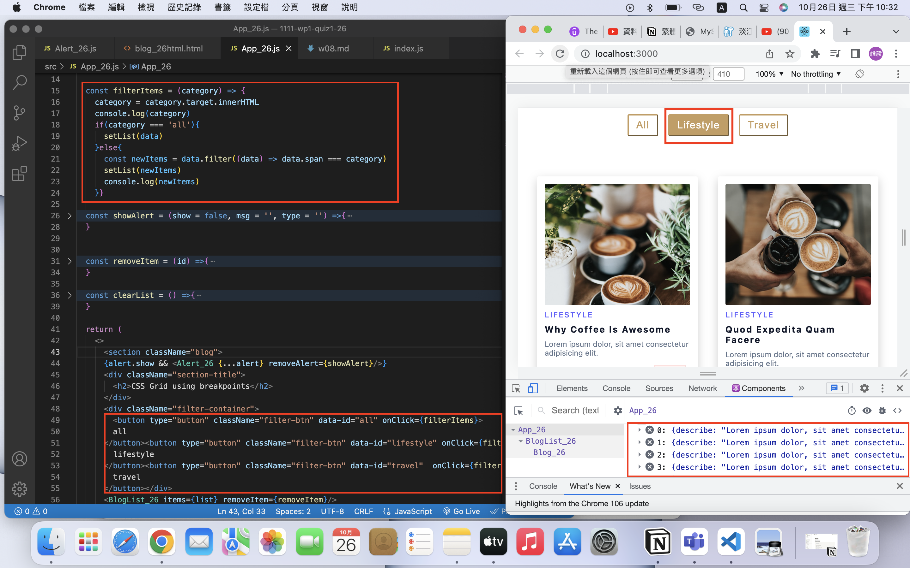
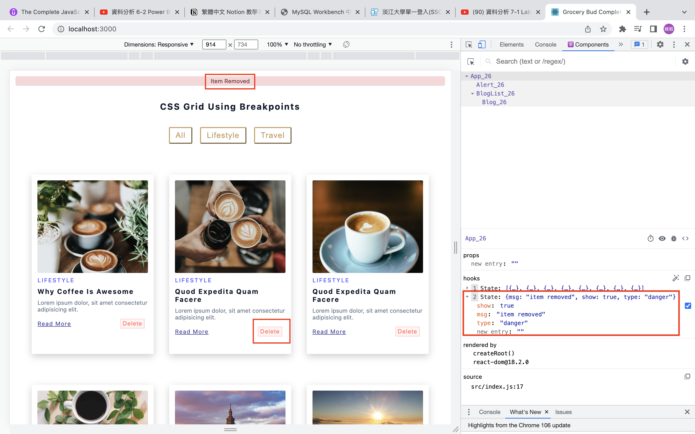
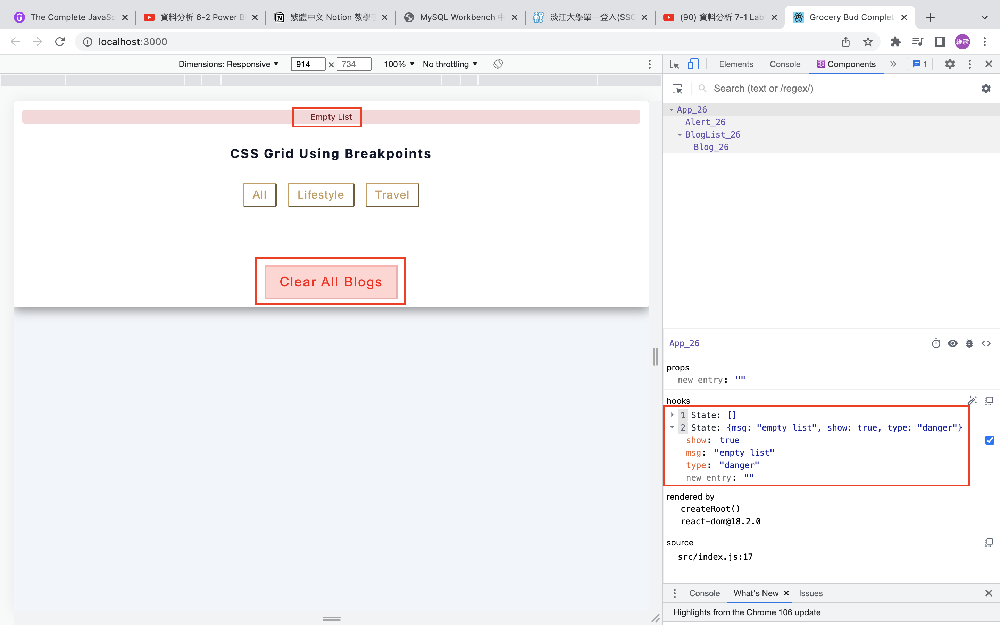

### W08-P1: a. 依學號從後往前，顯示對應的四筆 blog，結果圖片請參考 

### w01-p1.png; b. 顯示filter 篩選按鈕，結果圖片請參考 w03-p1.png


### W08-P2: 請將9筆 blogs資訊放入陣列 blogData_xx.js中，並能套入第1題的 App_xx.js 中，要能顯示所有的blogs


### W08-P3: 建立 components 目錄，並將陣列內的 9 筆 blogs 放入 BlogList_xx.js 與 Blog_xx.js 中



### W08-P4: 實作 Delete 按鈕，能夠刪除一筆 blog。結果圖片請參考 w06-p3.png，請明確列出相關的code與對應的結果圖片，不需要實作local storage，要透過 Chrome DevTool之React components 來顯示


### W08-P5: 實作 Clear All Blogs 按鈕，能夠刪除所有 blogs


### W08-P6: 實作 filter 功能


### W08-P7: 實作 Alert_xx.js，能夠顯示第 4 題 Delete 及第 5 題 Clear All Blogs 的訊息，顏色都是 danger 的紅色。




```
(base) huangweiyi@huangweiyideMacBook-Pro 1111-wp1-demo-26 % git log --pretty=format:"%h%x09%an%x09%ad%x09%s" --after="2022-10-25"
cc982ad WeiYiHuangfelix Wed Oct 26 23:04:51 2022 +0800  W08-P7: 實作 Alert_xx.js，能夠顯示第 4 題 Delete 及第 5 題 Clear All Blogs 的訊息，顏色都是 danger 的紅色。
8df1438 WeiYiHuangfelix Wed Oct 26 23:04:15 2022 +0800  W08-P6: 實作 filter 功能
2d60089 WeiYiHuangfelix Wed Oct 26 23:03:34 2022 +0800  W08-P5: 實作 Clear All Blogs 按鈕，能夠刪除所有 blogs
a28f2b7 WeiYiHuangfelix Wed Oct 26 23:02:55 2022 +0800  W08-P4: 實作 Delete 按鈕，能夠刪除一筆 blog。結果圖片請參考 w06-p3.png，請明確列出相關的code與對應的結果圖片，不需要實作local storage，要透過 Chrome DevTool之React components 來顯示
36bbab8 WeiYiHuangfelix Wed Oct 26 23:02:09 2022 +0800  W08-P3: 建立 components 目錄，並將陣列內的 9 筆 blogs 放入 BlogList_xx.js 與 Blog_xx.js 中
30ca37d WeiYiHuangfelix Wed Oct 26 23:01:26 2022 +0800  W08-P2: 請將9筆 blogs資訊放入陣列 blogData_xx.js中，並能套入第1題的 App_xx.js 中，要能顯示所有的blogs
5936b11 WeiYiHuangfelix Wed Oct 26 23:00:34 2022 +0800  w01-p1.png; b. 顯示filter 篩選按鈕，結果圖片請參考 w03-p1.png
096d8a1 WeiYiHuangfelix Wed Oct 26 22:58:53 2022 +0800  W08-P1: a. 依學號從後往前，顯示對應的四筆 blog，結果圖片請參考
```