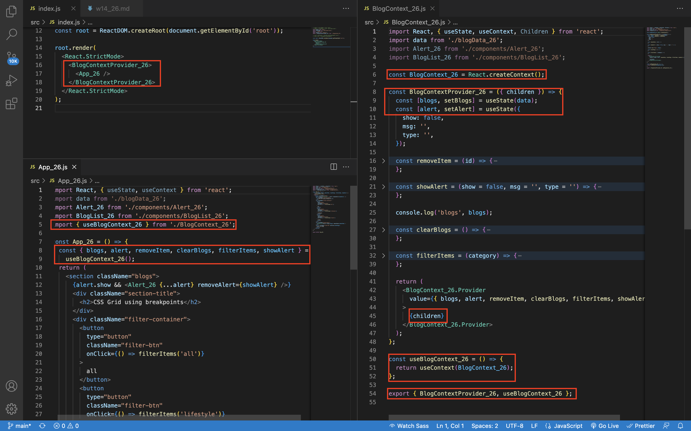

### W14-P1: App1_xx contains BlogList_xx, Blog_xx functional components


### W14-P2: App_xx, BlogList_xx, Blog_xx as separate components


### W14-P3: define BlogContext_xx and use it in <App_xx />, <BlogList_xx />, <Blog_xx /> components


```
(base) huangweiyi@huangweiyideMacBook-Pro 1111-wp1-demo-26 % git log --pretty=format:"%h%x09%an%x09%ad%x09%s" --after="2022-09-06"
dddc4b5 WeiYiHuangfelix Fri Dec 9 12:02:39 2022 +0800   W14-P3: define BlogContext_xx and use it in <App_xx />, <BlogList_xx />, <Blog_xx /> components
b95a540 WeiYiHuangfelix Fri Dec 9 11:48:58 2022 +0800   App_xx, BlogList_xx, Blog_xx as separate components
b952677 WeiYiHuangfelix Fri Dec 9 11:38:44 2022 +0800   App1_xx contains BlogList_xx, Blog_xx functional components
```