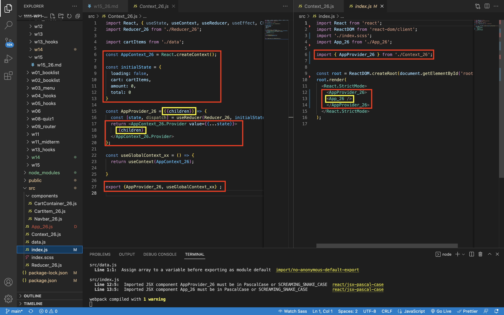
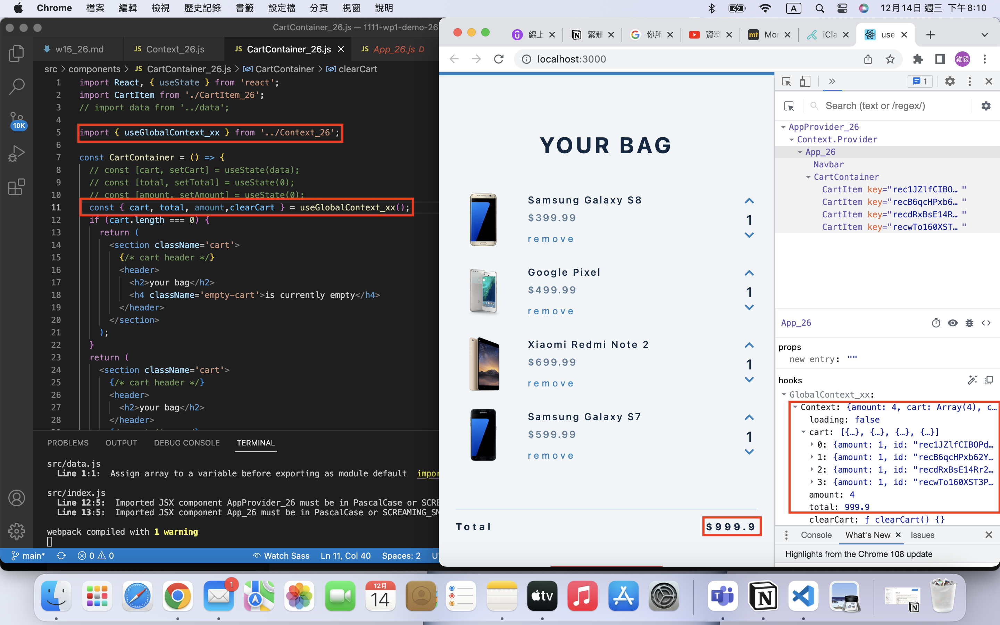
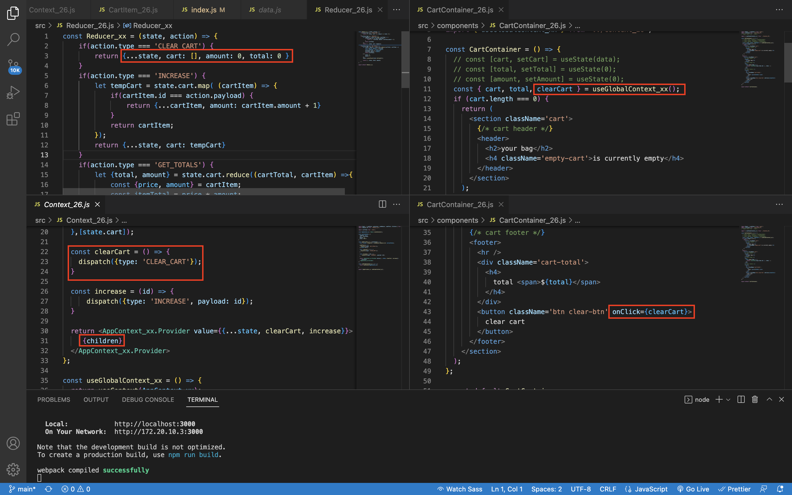
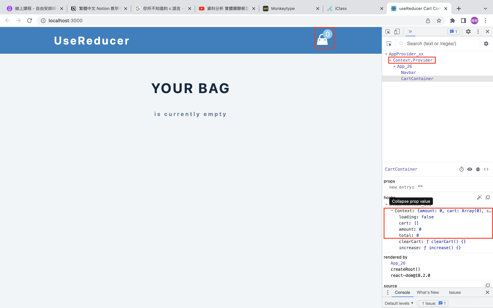
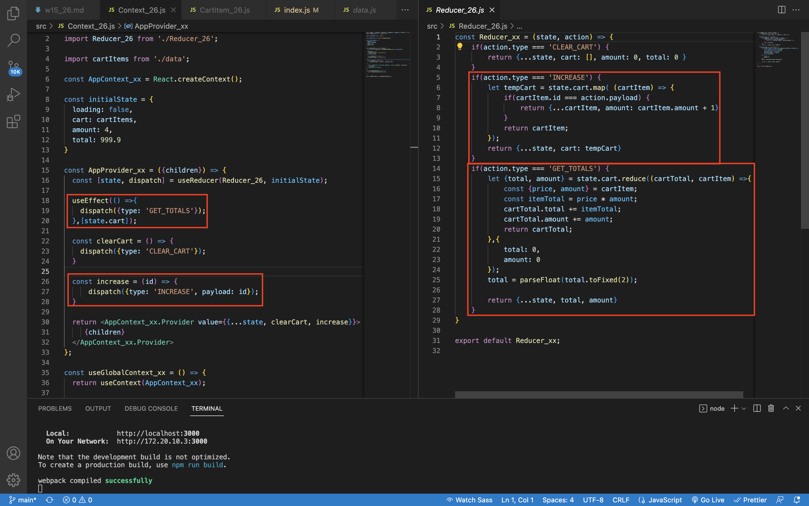
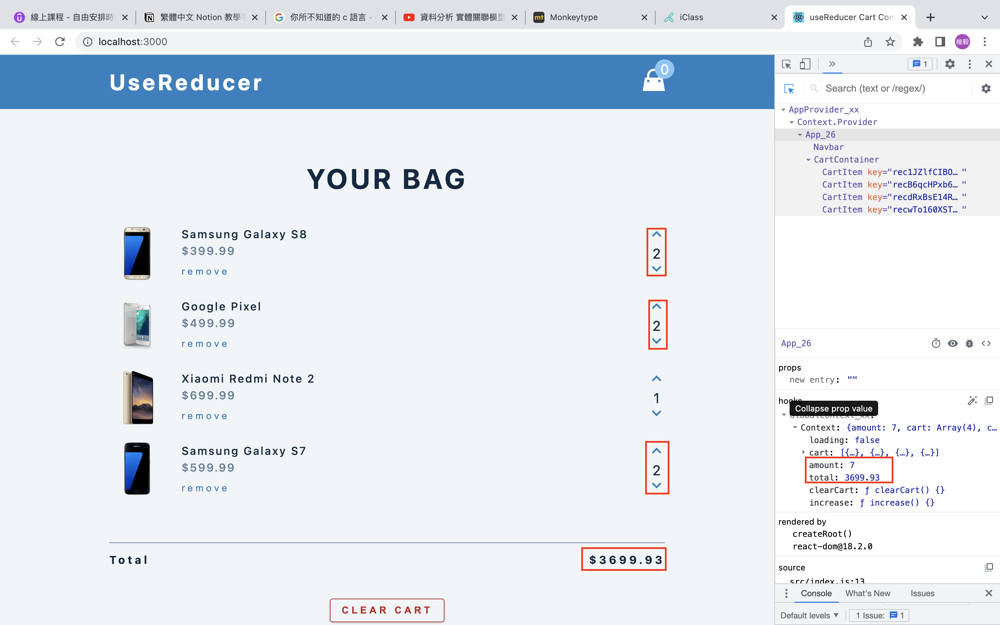

### W15-P1: Setup AppProvider_xx for App_xx and get state data



### W15-P2: replace data in CartContainer using global context


### W15-P3: put clear cart function in global context



### W15-P4: provide increase and get total function in global context



### W15-P5:


```
851f3c0 WeiYiHuangfelix Thu Dec 15 15:54:53 2022 +0800  W15-P4: provide increase and get total function in global context
416fbad WeiYiHuangfelix Thu Dec 15 15:54:26 2022 +0800  W15-P3: put clear cart function in global context
45e439e WeiYiHuangfelix Thu Dec 15 15:53:52 2022 +0800  W15-P2: replace data in CartContainer using global context
239a35b WeiYiHuangfelix Thu Dec 15 15:52:56 2022 +0800  W15-P1: Setup AppProvider_xx for App_xx and get state data
```