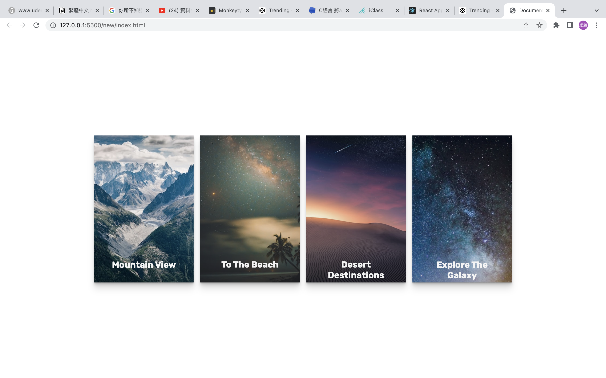
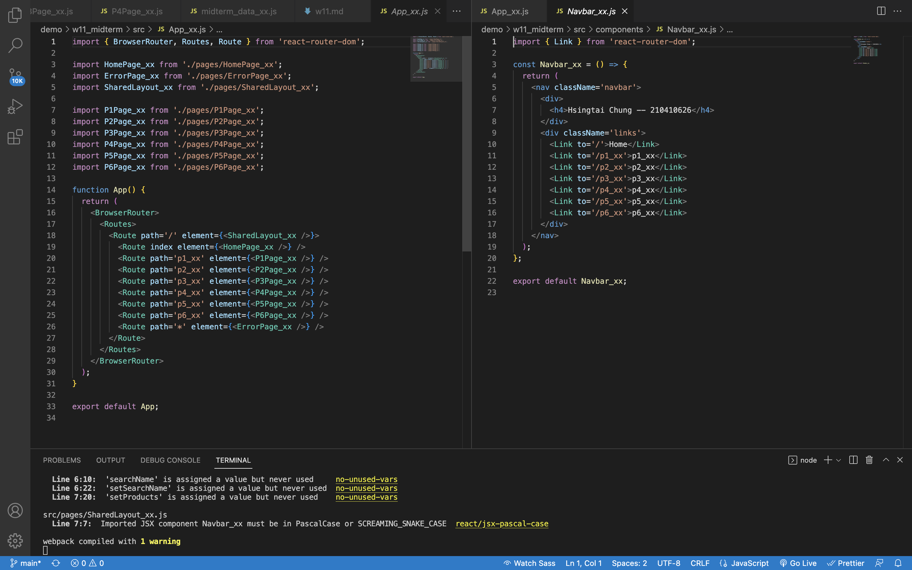
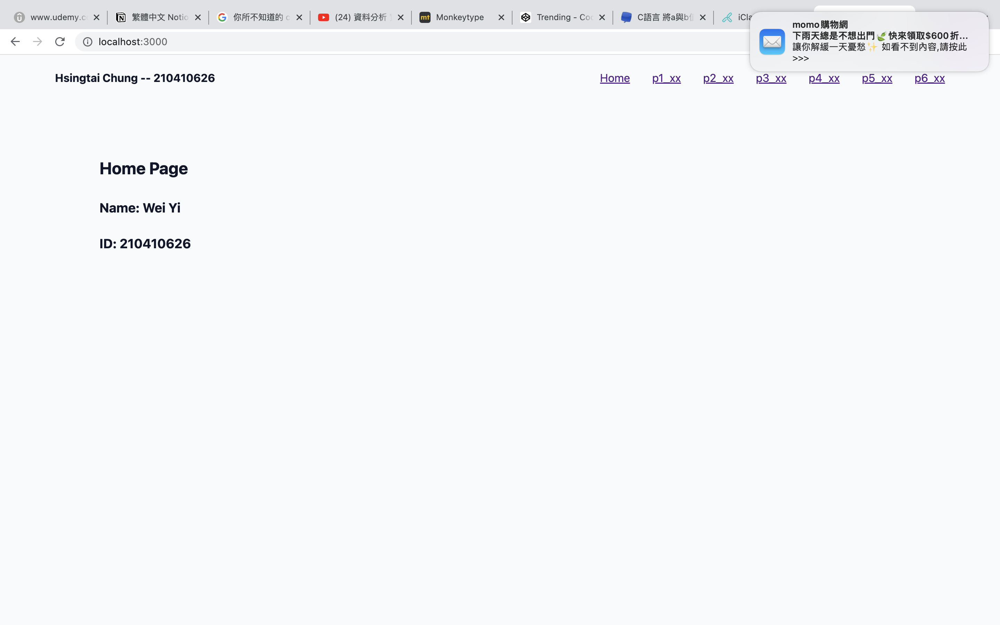
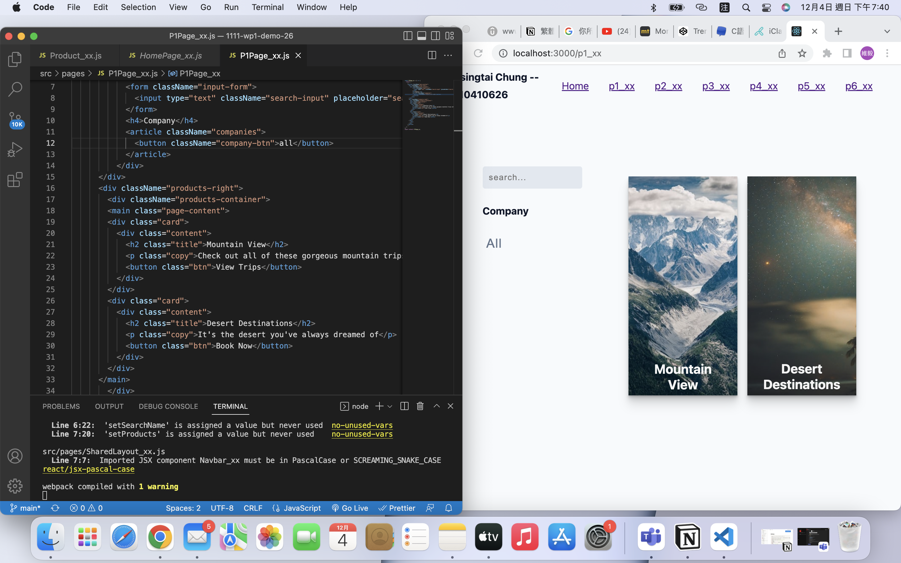
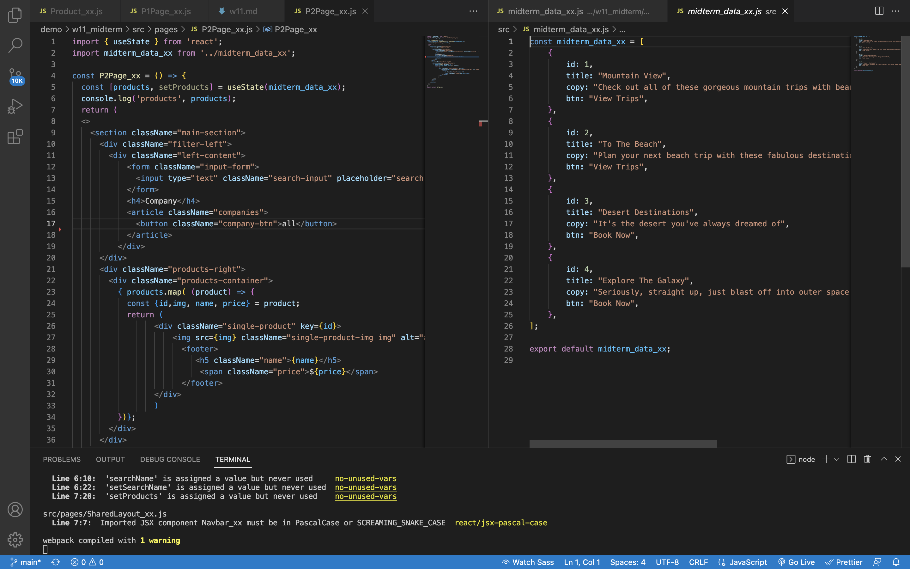
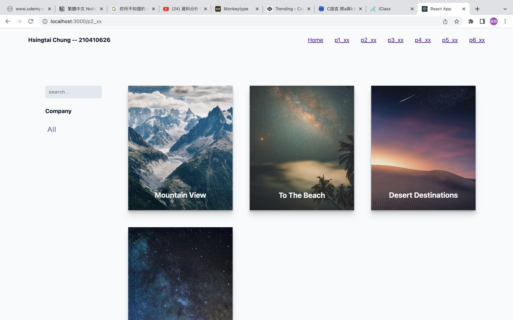
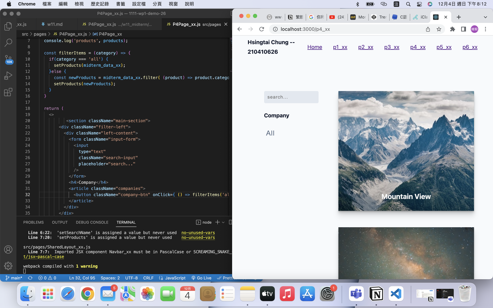
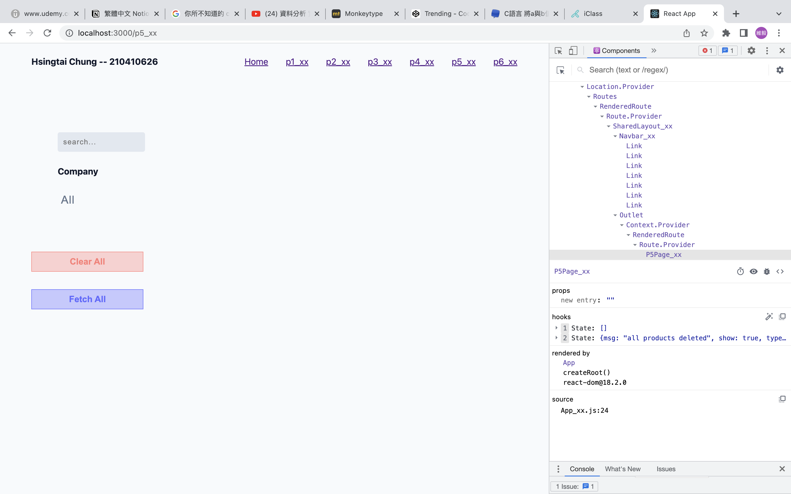
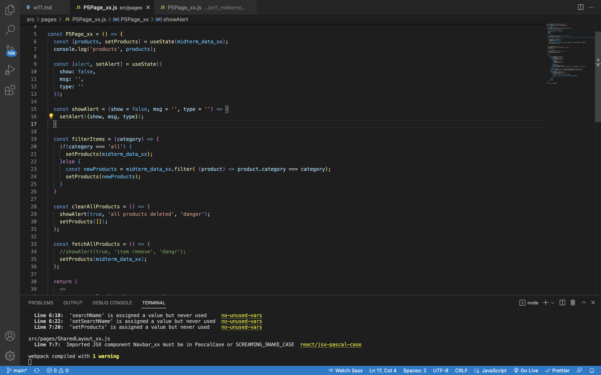

### 學號210410626 姓名黃維毅 補救教學
### 第一部分

#### 1.1 提供 theme 來源 URL 及圖片:
https://codepen.io/trending

#### 1.2 theme 介紹:

##### 左邊那張圖是建立連結右邊的圖是呈現畫面上的連結

##### 這張圖是呈現第一張程式的畫面
```
    <nav className='navbar'>
      <div>
        <h4>Hsingtai Chung -- 210410626</h4>
      </div>
      <div className='links'>
        <Link to='/'>Home</Link>
        <Link to='/p1_xx'>p1_xx</Link>
        <Link to='/p2_xx'>p2_xx</Link>
        <Link to='/p3_xx'>p3_xx</Link>
        <Link to='/p4_xx'>p4_xx</Link>
        <Link to='/p5_xx'>p5_xx</Link>
        <Link to='/p6_xx'>p6_xx</Link>
      </div>
    </nav>
```
```
function App() {
  return (
    <BrowserRouter>
      <Routes>
        <Route path='/' element={<SharedLayout_xx />}>
          <Route index element={<HomePage_xx />} />
          <Route path='p1_xx' element={<P1Page_xx />} />
          <Route path='p2_xx' element={<P2Page_xx />} />
          <Route path='p3_xx' element={<P3Page_xx />} />
          <Route path='p4_xx' element={<P4Page_xx />} />
          <Route path='p5_xx' element={<P5Page_xx />} />
          <Route path='p6_xx' element={<P6Page_xx />} />
          <Route path='*' element={<ErrorPage_xx />} />
        </Route>
      </Routes>
    </BrowserRouter>
  );
}
```

##### 利用老師所教的來結合網路上找的codepen來結合成這張圖
```
        <main class="page-content">
        <div class="card">
          <div class="content">
            <h2 class="title">Mountain View</h2>
            <p class="copy">Check out all of these gorgeous mountain trips with beautiful views of, you guessed it, the mountains</p>
            <button class="btn">View Trips</button>
          </div>
        </div>
        <div class="card">
          <div class="content">
            <h2 class="title">Desert Destinations</h2>
            <p class="copy">It's the desert you've always dreamed of</p>
            <button class="btn">Book Now</button>
          </div>
        </div>
      </main>
```


##### 右邊程式碼是寫出陣列的方式 左邊用函式的代入陣列的屬性值所呈現的畫面
```
    <div className="products-right">
        <div className="products-container">
          { products.map( (product) => {
            const {id,img, name, price} = product;
            return (
                  <div className="single-product" key={id}>
                      
                        <footer>
                           <h5 className="name">{name}</h5>
                            <span className="price">${price}</span>
                        </footer>
                  </div>
                  )
          })};
        </div>
      </div>
```
```
const midterm_data_xx = [
    {
        id: 1,
        title: "Mountain View",
        copy: "Check out all of these gorgeous mountain trips with beautiful views of, you guessed it, the mountains",
        btn: "View Trips",
    },
    {
        id: 2,
        title: "To The Beach",
        copy: "Plan your next beach trip with these fabulous destinations",
        btn: "View Trips",
    },
    {
        id: 3,
        title: "Desert Destinations",
        copy: "It's the desert you've always dreamed of",
        btn: "Book Now",
    },
    {
        id: 4,
        title: "Explore The Galaxy",
        copy: "Seriously, straight up, just blast off into outer space today",
        btn: "Book Now",
    },
];
```

##### 右邊是用函式的方式取陣列裡面的值 左邊用useState取陣列 用路由的方式取值來呈現畫面
```
const Product_xx = ({id, title, copy, btn}) => {
  return (
    <>
        <div key={id} class="card">
              <div class="content">
                <h2 class="title">{title}</h2>
                <p class="copy">{copy}</p>
                <button class="btn">{btn}</button>
              </div>
            </div>
    </>
  );
};
export default Product_xx;
```
```
        <div className="products-right">
          <div className="products-container">
            {products.map((product) => {
              const { id, img, name, price } = product;
              return (
                <Product_xx key={id} img={img} name={name} price={price} />
              );
            })}
            ;
          </div>
        </div>
```

##### 這一題是寫判斷 category寫在陣列裡面 抓取這個值 來讓all來呈現全部畫面 否則就個別呈現 因為我的照片適用 css呈現 所以用這樣的方式呈現 只會出現第一張圖所以我才把按鈕取消有做一些修改
```
const P4Page_xx = () => {
  const [products, setProducts] = useState(midterm_data_xx);
  console.log('products', products);

  const filterItems = (category) => {
    if(category === 'all') {
      setProducts(midterm_data_xx);
    }else {
      const newProducts = midterm_data_xx.filter( (product) => product.category === category);
      setProducts(newProducts);
    }
  }

  return (
    <>
      <section className="main-section">
        <div className="filter-left">
          <div className="left-content">
            <form className="input-form">
              <input
                type="text"
                className="search-input"
                placeholder="search..."
              />
            </form>
            <h4>Company</h4>
            <article className="companies">
              <button className="company-btn" onClick={ () => filterItems('all')}>all</button>
            </article>
          </div>
        </div>
        <div className="products-right">
          <div className="products-container">
            {products.map((product) => {
               const { id, title, copy, btn } = product;
               return (
                 <Product_xx key={id} title={title} copy={copy} btn={btn} />
               );
            })}
          </div>
        </div>
      </section>
    </>
  );
};
```


##### 按下Ｃlear ALL 會在State呈現空值 表示有清除掉資料

##### 按下Felch ALL 資料會全部還原
```
const P5Page_xx = () => {
  const [products, setProducts] = useState(midterm_data_xx);
  console.log('products', products);

  const [alert, setAlert] = useState({
    show: false,
    msg: '',
    type: ''
  });

  const showAlert = (show = false, msg = '', type = '') => {
    setAlert({show, msg, type});
  }

  const filterItems = (category) => {
    if(category === 'all') {
      setProducts(midterm_data_xx);
    }else {
      const newProducts = midterm_data_xx.filter( (product) => product.category === category);
      setProducts(newProducts);
    }
  } 

  const clearAllProducts = () => {
    showAlert(true, 'all products deleted', 'danger');
    setProducts([]);
  };

  const fetchAllProducts = () => {
    //showAlert(true, 'item remove', 'dangr');
    setProducts(midterm_data_xx);
  };

  return (
    <>
      <section className="main-section">
        <div className="filter-left">
          <div className="left-content">
            <form className="input-form">
              <input
                type="text"
                className="search-input"
                placeholder="search..."
              />
            </form>
            <h4>Company</h4>
            <article className="companies">
              <button className="company-btn" onClick={ () => filterItems('all')}>all</button>
            </article>
          </div>
          <button className='clear-btn' onClick={clearAllProducts}> Clear All</button>
          <button className='fetch-btn' onClick={fetchAllProducts}> Fetch All</button>
        </div>
        { alert.show && <Alert_xx {...alert} removeAlert = {showAlert} /> } 
        <div className="products-right">
          <div className="products-container">
            {products.map((product) => {
               const { id, title, copy, btn } = product;
               return (
                 <Product_xx key={id} title={title} copy={copy} btn={btn} />
               );
            })}
          </div>
        </div>
      </section>
    </>
  );
};
```
```
(base) huangweiyi@huangweiyideMacBook-Pro 1111-wp1-demo-26 % git log --pretty=format:"%h%x09%an%x09%ad%x09%s" --after="2022-09-06"
9d861ce WeiYiHuangfelix Sun Dec 4 21:35:53 2022 +0800   w11-p5
ffca06c WeiYiHuangfelix Sun Dec 4 21:32:42 2022 +0800   w11-p4
807ae96 WeiYiHuangfelix Sun Dec 4 21:29:41 2022 +0800   w11-p3
460e592 WeiYiHuangfelix Sun Dec 4 21:15:50 2022 +0800   w11-p2
0ad4e16 WeiYiHuangfelix Sun Dec 4 21:07:48 2022 +0800   w11-p1
1194070 WeiYiHuangfelix Thu Dec 1 21:34:33 2022 +0800   W13-P2: Apply useReducer to add an item with modal alert
```